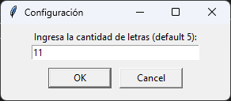
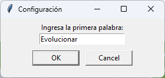
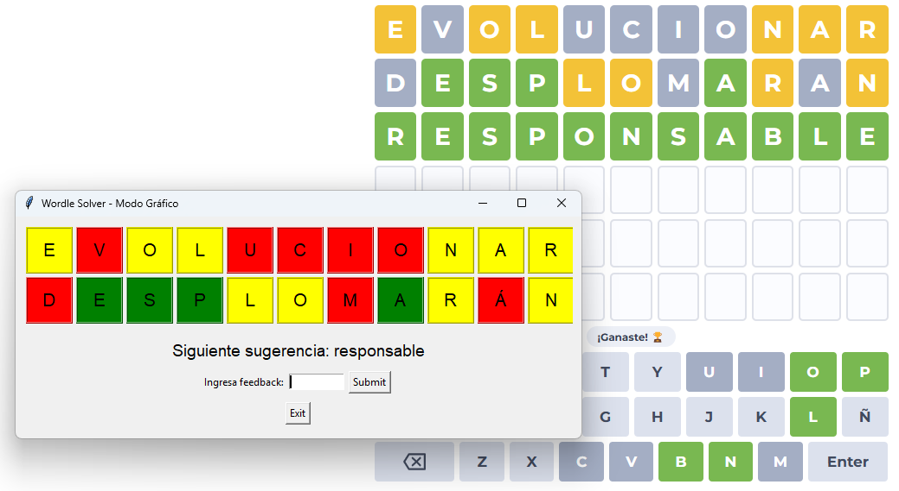

# WORDLE RESOLVER
## índice
1. [Descripción](#descripción)
2. [Instalación y ejecucción](#instalación-y-ejecucción)
3. [Imágenes](#imágenes)
4. [Créditos](#créditos)
5. [Licencia](#licencia)

## Descripción
Este programa resuelve el juego de Wordle. Deberás elegir el número de letras que tendrá la palabra a adivinar y darle feedback al script para que intente dar con la respuesta correcta. Tiene opción de jugarlo en modo gráfico o en modo texto.

Es compatible con tildes, diéresis, *eñes* y letras repetidas.

Para proporcionar feedback, deberás escribir uno de los 3 siguientes letras:
- **B**: La letra está en la palabra y en la posición correcta.
- **C**: La letra está en la palabra pero en una posición incorrecta.
- **M**: La letra no está en la palabra.

Por ejemplo, si la palabra a adivinar es "VIVIR" y la respuesta correcta es "ABRIL", el feedback sería "MMMBC".

## Instalación y ejecucción
Para instalar el programa, deberás clonar el repositorio en tu máquina local. Para ello, abre una terminal y escribe el siguiente comando:
```bash
git clone
```
Una vez clonado el repositorio, accede a la carpeta del proyecto y ejecuta el script de Python:
```bash
python wordle.py
```

## Imágenes




## Créditos
- El diccionario utilizado (*[palabras.txt](/palabras.txt)*) ha sido obtenido del repositorio de [Jorge Duenas Lerin](https://github.com/JorgeDuenasLerin) - [Diccionario-espanol-txt](https://github.com/JorgeDuenasLerin/diccionario-espanol-txt) - [02/02/2025].
- La [captura de pantalla](/assets/elevenWordsWin_gui.png) del Wordle web pertence a [Wordly](https://wordly.org/es) - [02/02/2025].

## Licencia
Este proyecto está bajo la licencia [MIT](/LICENSE).